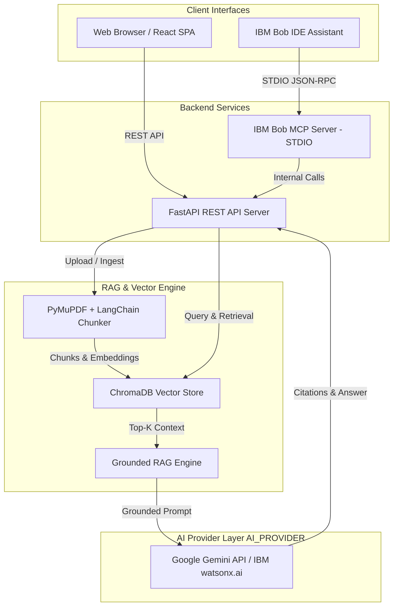
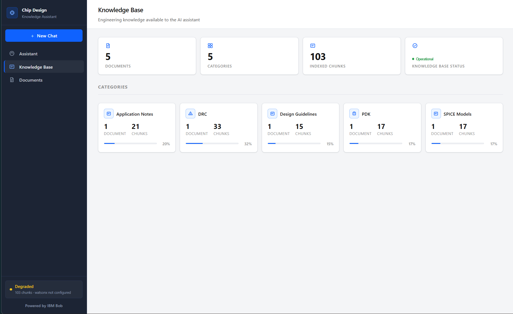
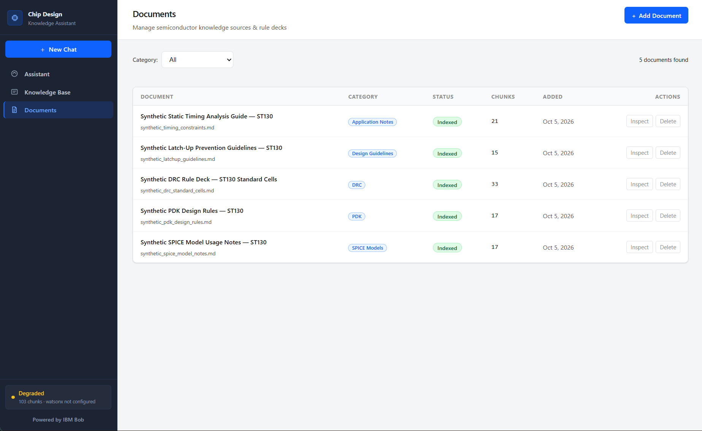
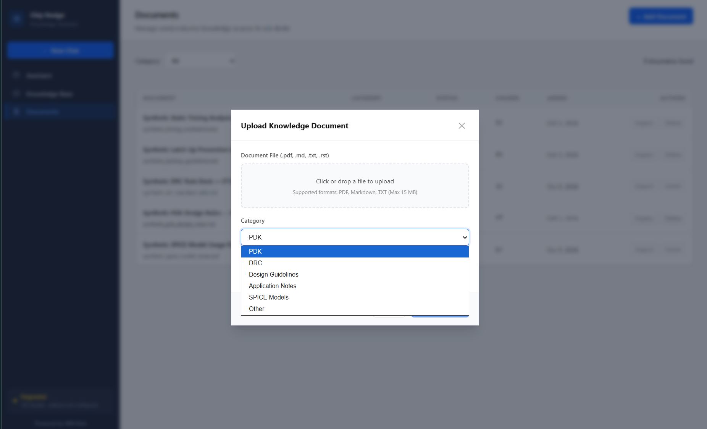
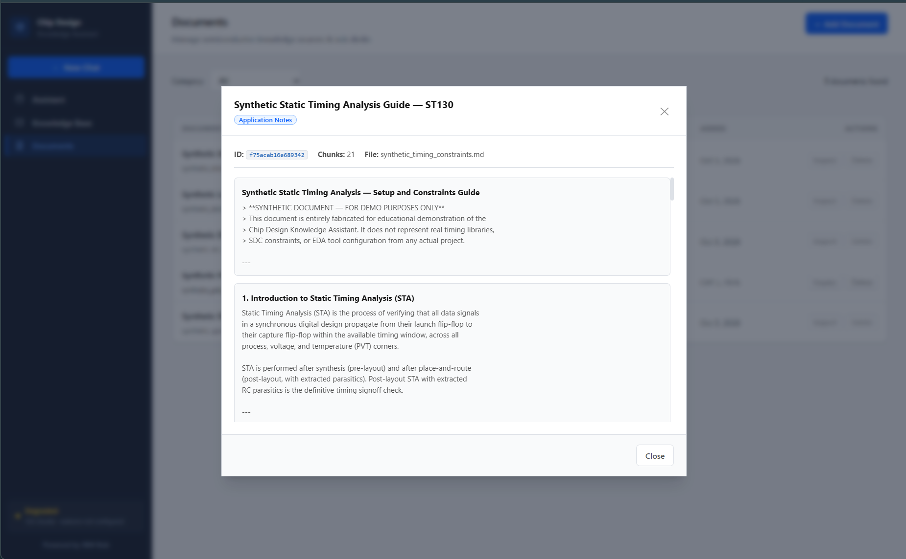
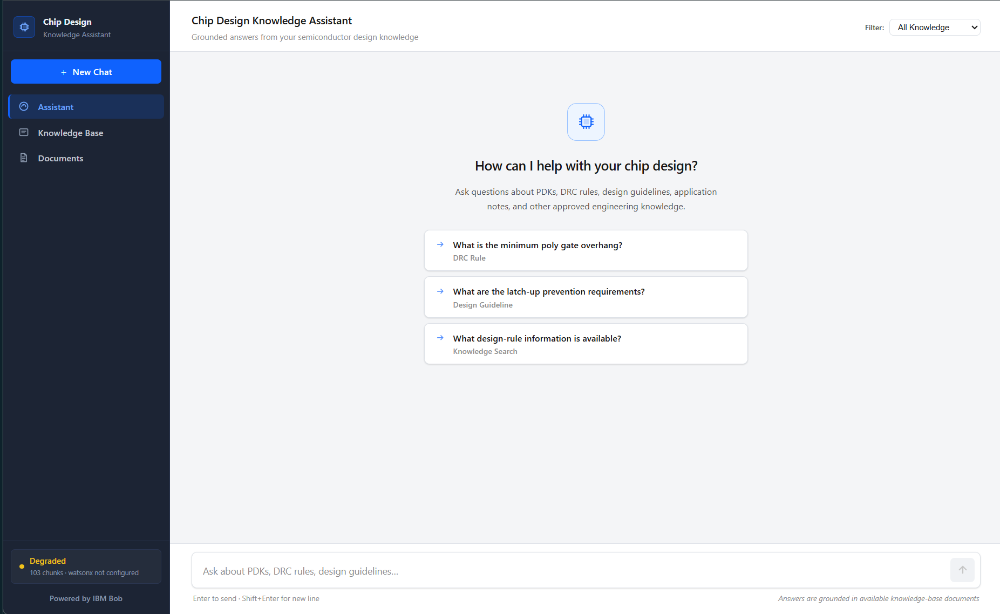

# 🚀 Chip Design Knowledge Assistant

> **IBM Bob Hackathon Submission — Track: AI**

[](submission.yaml)
[](submission.yaml)
[](src/backend/)
[](src/frontend/)
[](src/backend/)
[](src/tests/)
[](src/backend/config.py)
[](src/mcp_server/)

---

## 👥 Team Information

| Field | Value |
|---|---|
| **Team Name** | **HackSphere** |
| **Track** | **AI** |
| **Team Lead** | Jk Patel (`jkpatel@example.com`) |
| **Repository** | [bob-ai-hackathon-team-HackSphere](https://github.com/Jk-patel-07/bob-ai-hackathon-team-HackSphere) |

---

## 🎯 Problem Statement

Semiconductor IC physical design engineers spend significant technical effort searching through lengthy Process Design Kit (PDK) documentation, Design Rule Checking (DRC) manuals, Layout Versus Schematic (LVS) guidelines, latchup prevention rules, and timing constraint specifications.

1. **Information Fragmentation & Context Switching:** Technical specifications are scattered across multi-page PDFs, Markdown guidelines, and wiki pages. Context switching between layout tools (e.g., Cadence Virtuoso, Synopsys Klayout) and documentation viewers severely slows down layout verification cycles.
2. **High Risk of AI Hallucinations:** Generic ungrounded LLMs frequently hallucinate exact numeric design tolerances (such as minimum metal pitch, well-tap spacing, or antenna ratio limits). In semiconductor manufacturing, applying incorrect tolerances results in costly silicon re-spins.

---

## 💡 Solution Overview

The **Chip Design Knowledge Assistant** is a domain-specific Retrieval-Augmented Generation (RAG) system built to serve semiconductor layout and physical verification engineers.

It features a **strict anti-hallucination grounding architecture**:
- Answers are generated **exclusively** from retrieved document sections.
- When supporting evidence is missing or similarity scores fall below threshold (`< 0.30`), the system returns an **explicit insufficient-information response**.
- Supports **dual AI providers** (Google Gemini API & IBM watsonx.ai) via simple environment configuration.
- Integrates directly into developer IDEs via an **IBM Bob Model Context Protocol (MCP)** STDIO server.



---

## ✨ Key Features

- **Strict Grounded Q&A with Citation Deduplication:** Retrieves relevant chunks from ChromaDB, passes verified context to the active LLM, and deduplicates source document citations down to the section level.
- **Low-Confidence Fallback Guardrails:** Automatically returns a standard insufficient-information message when document similarity falls below the threshold (default `0.30`) or when LLM analysis detects missing evidence.
- **Dual AI Provider Support (`AI_PROVIDER`):** Configurable provider abstraction layer supporting both **Google Gemini API** (`gemini-3.5-flash-lite`, `gemini-embedding-001`) and **IBM watsonx.ai** (`granite-13b-instruct-v2`, `slate-125m`).
- **IBM Bob Model Context Protocol (MCP) Server:** Provides 4 native MCP tools (`search_knowledge_base`, `get_document_sections`, `list_ingested_documents`, `check_backend_status`) enabling IBM Bob to query chip design specifications directly from the IDE.
- **Section-Aware Ingestion Pipeline:** Ingests PDF, Markdown, and TXT files, extracting heading-aware section chunks with stable document hashing.
- **Interactive Knowledge Base Dashboard:** Modern React 18 frontend with active AI provider status badges, document upload modal, document manager, document detail viewer, and category filtering.

---

## 🛠️ Tech Stack

| Category | Technologies Used |
|---|---|
| **Frontend** | React 18, Vite, TailwindCSS, Lucide Icons |
| **Backend REST API** | Python 3.11+, FastAPI, Uvicorn, Pydantic |
| **IBM Technologies** | IBM Bob (Model Context Protocol / MCP), IBM watsonx.ai (Supported Provider) |
| **AI & LLM Providers** | Google Gemini API (`google-genai`), IBM watsonx.ai (`ibm-watsonx-ai`) |
| **Vector Database** | ChromaDB (Persistent vector storage with cosine similarity indexing) |
| **Document Processing** | PyMuPDF (fitz), LangChain Text Splitters, hashlib |
| **Testing Suite** | pytest, pytest-asyncio (81 unit & integration tests passing) |

---

## 📁 Repository Structure

```
.
├── submission.yaml               # Hackathon submission metadata
├── README.md                     # Root project documentation
├── CONTRIBUTING.md               # Contribution guidelines
├── src/                          # Application source code
│   ├── backend/                  # FastAPI server, RAG engine, config, vector store
│   ├── mcp_server/               # IBM Bob MCP STDIO integration server
│   ├── frontend/                 # React 18 SPA UI (built into backend static)
│   ├── demo_data/                # Synthetic semiconductor specifications
│   ├── scripts/                  # Data seeding and setup scripts
│   └── tests/                    # 81 pytest unit & integration tests
├── docs/                         # Detailed architecture & technical docs
│   ├── problem-statement.md      # Deep dive into semiconductor domain problem
│   ├── solution-overview.md       # Solution capabilities and RAG design
│   ├── architecture.md           # Component architecture & data flow diagrams
│   └── setup-guide.md            # Detailed installation and deployment guide
├── demo/                         # Demo assets & links
│   ├── screenshots/              # High-resolution application screenshots
│   ├── demo-video-link.txt       # Video walkthrough URL
│   └── live-demo-url.txt         # Live deployment status note
└── presentation/                 # Hackathon slide deck
    ├── slides.pdf                # PDF slide presentation
    └── slides_content.md         # Slide content & speaker notes
```

---

## ⚡ How to Run

### 1. Prerequisites
- Python 3.11+
- Node.js 18+ (for frontend build)
- Google Gemini API Key or IBM watsonx.ai credentials

### 2. Environment Configuration
Clone the repository and copy the environment template:

```bash
git clone https://github.com/Jk-patel-07/bob-ai-hackathon-team-HackSphere.git
cd bob-ai-hackathon-team-HackSphere
cp src/.env.example src/.env
```

Edit `src/.env` to select your preferred AI provider:

**For Google Gemini (Recommended / Default):**
```env
AI_PROVIDER=gemini
GEMINI_API_KEY=your_gemini_api_key_here
GEMINI_MODEL=gemini-3.5-flash-lite
GEMINI_EMBED_MODEL=gemini-embedding-001
```

**For IBM watsonx.ai:**
```env
AI_PROVIDER=watsonx
WATSONX_API_KEY=your_watsonx_api_key_here
WATSONX_PROJECT_ID=your_watsonx_project_id_here
```

### 3. Install Dependencies & Start Server
```bash
# Navigate to source directory
cd src

# Install Python requirements
pip install -r requirements.txt

# Seed synthetic demo data (100+ document chunks)
python scripts/seed_demo_data.py

# Start FastAPI application server
python -m uvicorn backend.main:app --host 127.0.0.1 --port 8000
```

Access the Web Application in your browser:
👉 **[http://localhost:8000](http://localhost:8000)**

---

## 🤖 IBM Bob MCP Integration

To connect IBM Bob to the Chip Design Knowledge Assistant via Model Context Protocol (MCP), add the following configuration to your `bob.json` / MCP config:

```json
{
  "mcpServers": {
    "chip-design-assistant": {
      "command": "python",
      "args": [
        "c:/path/to/bob-ai-hackathon-team-HackSphere/src/mcp_server/server.py"
      ],
      "env": {
        "BACKEND_URL": "http://127.0.0.1:8000"
      }
    }
  }
}
```

### Available MCP Tools for IBM Bob:
1. `search_knowledge_base`: Queries chip design docs and returns grounded answers with citations.
2. `get_document_sections`: Retrieves exact section breakdowns for a specific ingested document.
3. `list_ingested_documents`: Returns all ingested PDK, DRC, and specification documents.
4. `check_backend_status`: Returns active AI provider, chunk counts, and system health.

---

## 🧪 Verification & Testing

The backend includes a comprehensive pytest suite covering API endpoints, document parsing, ChromaDB operations, grounded RAG scoring, and provider switching.

```bash
# Run pytest test suite from project root
python -m pytest src/tests

# Output: 81 passed in 5.90s
```

To test or rebuild the frontend SPA:
```bash
cd src/frontend
npm install
npm run build
```

---

## 🖼️ Screenshots & Demo Evidence

| View | Description | Screenshot |
|---|---|---|
| **01. Home Dashboard** | Main query interface with AI provider status badge & category pills | [](demo/screenshots/01-home-dashboard.png) |
| **02. Grounded Query** | Technical query on metal pitch design rules returning exact answer | [](demo/screenshots/02-grounded-query.png) |
| **03. Citation Result** | Section-level citation deduplication and context source highlights | [](demo/screenshots/03-citation-result.png) |
| **04. Knowledge Base** | Ingested semiconductor specification documents & chunk stats | [](demo/screenshots/04-knowledge-base.png) |
| **05. Document Management** | Section content inspector, document upload, and deletion | [](demo/screenshots/05-documents.png) |

---

## ⚠️ Known Limitations

- **Hackathon Prototype / MVP:** Built as a single-tenant hackathon prototype focused on core RAG reliability and MCP integration.
- **Synthetic Demo Data:** Ships with synthetic semiconductor specifications (`synthetic_pdk_design_rules.md`, `synthetic_drc_standard_cells.md`, `synthetic_latchup_guidelines.md`) for demonstration purposes rather than real proprietary foundry PDK rules.
- **Local Single-Tenant Execution:** Authentication is scaffolded for local execution. Production enterprise deployment would require OAuth2/OIDC integration.

---

## 🏅 What We're Most Proud Of

We are most proud of our **strict anti-hallucination grounding architecture** and **seamless dual-interface capability**. Engineers can search, inspect documents, and query grounded chip design insights either visually through the web application or directly inside IBM Bob via Model Context Protocol (MCP) tools without leaving their IDE.

---

## 📜 License

This project is submitted under the Apache 2.0 License for the IBM Bob AI Hackathon.
