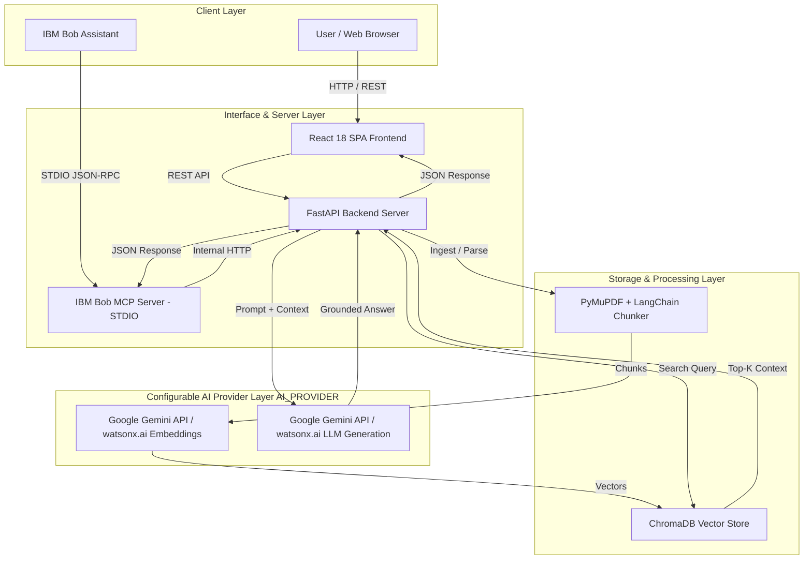

# Architecture — Chip Design Knowledge Assistant

## System Architecture

The diagram below illustrates the end-to-end architecture, including the React SPA frontend, FastAPI REST backend, ChromaDB vector store, AI Provider layer (Google Gemini API / IBM watsonx.ai), and the IBM Bob MCP server integration.

---

## Components

| Component | Technology | Responsibility |
|---|---|---|
| **Frontend UI** | React 18, Vite, TailwindCSS | Single Page Application offering chat interface, document management, status tracking, and category filters. |
| **Backend REST API** | FastAPI, Pydantic, Uvicorn | Exposes endpoints (`/health`, `/search`, `/documents`, `/documents/upload`, `/categories`), orchestrates RAG pipeline, and handles CORS & error responses. |
| **MCP Server** | Python `mcp` SDK (STDIO Transport) | Exposes 4 Model Context Protocol tools (`search_knowledge_base`, `get_document_sections`, `list_ingested_documents`, `check_backend_status`) to IBM Bob. |
| **Document Parser** | PyMuPDF, LangChain Splitters | Parses PDF, Markdown, and TXT files into heading-aware text chunks with stable document IDs and metadata. |
| **Vector Store** | ChromaDB | Persists document vectors locally with cosine similarity indexing; handles chunk insertion, deletion, and filtering by category. |
| **AI Provider Abstraction** | Google Gemini API / IBM watsonx.ai | Configurable via `AI_PROVIDER=gemini` or `AI_PROVIDER=watsonx`. Handles text embeddings (`text-embedding-004` / `slate-125m`) and grounded generation (`gemini-2.5-flash` / `granite-13b-instruct-v2`). |

---

## Data Flow

1. **Document Ingestion:**
   - User uploads PDF/Markdown/TXT via frontend or `POST /documents/upload` API.
   - Document parser extracts text sections and chunks content into ~500-token segments.
   - Embeddings wrapper converts chunks to vectors via active AI provider (`gemini` or `watsonx`).
   - Vectors and metadata (doc_id, filename, category, section) are stored in ChromaDB.

2. **Grounded Query Processing:**
   - User enters query in React chat UI or IBM Bob invokes `search_knowledge_base`.
   - FastAPI queries ChromaDB for top 5 most similar chunks.
   - If max similarity score is below `0.30`, RAG engine immediately returns insufficient-information message.
   - If similarity passes threshold, retrieved chunks are formatted into a system prompt enforcing zero ungrounded speculation.
   - Prompt is sent to active LLM provider (`gemini-2.5-flash` or `granite-13b-instruct-v2`).
   - Response is parsed, citations are deduplicated, and JSON answer with citations is returned.

---

## Security Considerations

- **Secret Management:** API keys (`GEMINI_API_KEY`, `WATSONX_API_KEY`, `WATSONX_PROJECT_ID`) are configured exclusively via environment variables (`.env`) and excluded from source control via `.gitignore`.
- **Injection Protection:** User input is isolated inside parameterized prompt templates to prevent prompt injection attacks.
- **Local Single-Tenant Execution:** Designed for local single-tenant hackathon prototype execution; network traffic remains bound to localhost (`127.0.0.1:8000`).

---

## Scalability Notes

- **Hackathon Prototype / MVP:** Currently implemented as a single-node FastAPI instance with local ChromaDB vector storage.
- **Future Production Path:** The FastAPI application is stateless and can be deployed in containers (e.g., IBM Cloud Code Engine). ChromaDB can be migrated to a distributed Chroma cluster or PostgreSQL with `pgvector` for multi-tenant enterprise scale.
